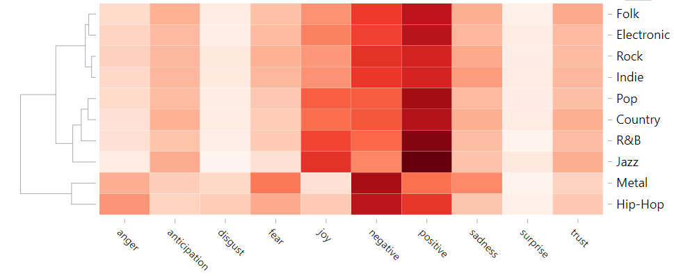
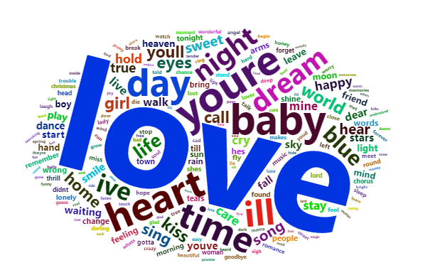
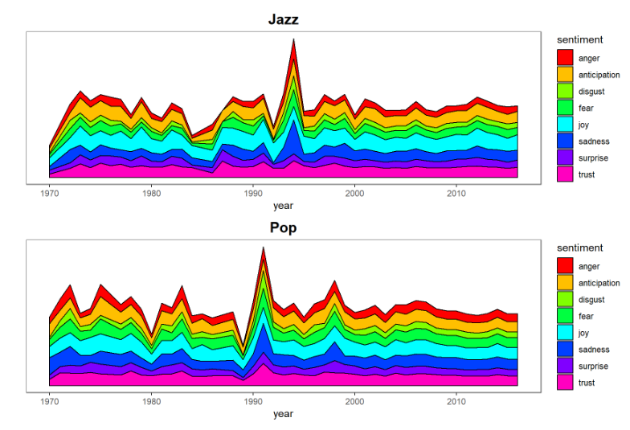

# Text Mining of Song Lyrics


## Project Summary

In this project, I apply text mining and natural language processing techniques to get insight into the characteristics of different types of song lyrics. Once I compare the lyrics of songs in distinct music genres, I identify several interesting patterns on their sentiments, topics and content length. Intriguingly, more inspiration is derived by relating the lyrics’ sentiments with the music history.

## Datasets

+ "lyrics.csv" ([Download](https://www.dropbox.com/s/3tfv5v73z0ec8vr/lyrics.csv?dl=0)) is a filtered corpus of 100,000+ song lyrics from MetroLyrics. Available features are song name, year, artist, genre, and lyrics. You can find the complete 380,000+ song lyrics data on [Kaggle](https://www.kaggle.com/gyani95/380000-lyrics-from-metrolyrics). A ```lyrics.RData``` file is also provided in the [\data folder](../data/).

+ "artists.csv" (in the [\data folder](../data/)) provides additional background information of all the artistis. For the singers, a detailed biography is provided. And for the bands, available information are members, established year and location.

## Data Story

[Song Lyrics: The Soul of Music](doc/Project_report.html) 

## Example of Visualizations





Following [suggestions](http://nicercode.github.io/blog/2013-04-05-projects/) by [RICH FITZJOHN](http://nicercode.github.io/about/#Team) (@richfitz). This folder is orgarnized as follows.

```
proj/
├── lib/
├── data/
├── doc/
├── figs/
└── output/
```

Please see each subfolder for a README file.
